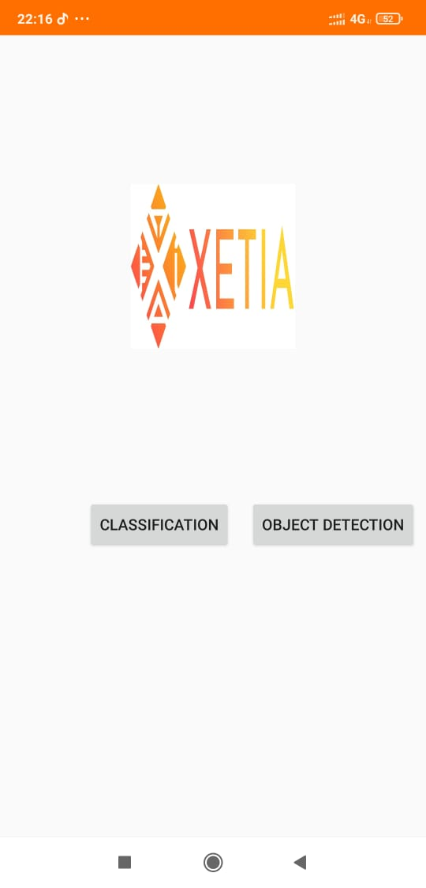
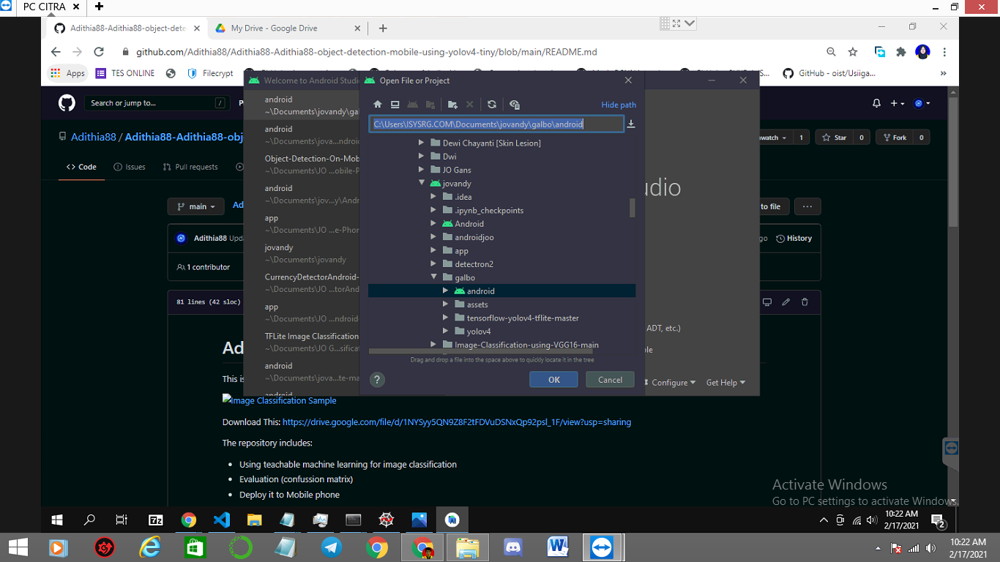
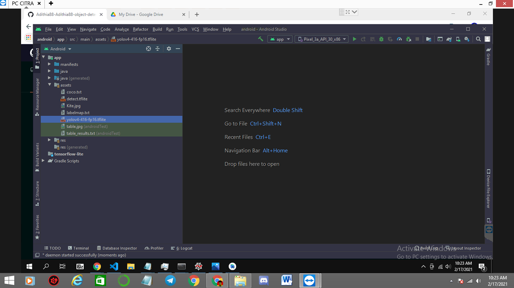
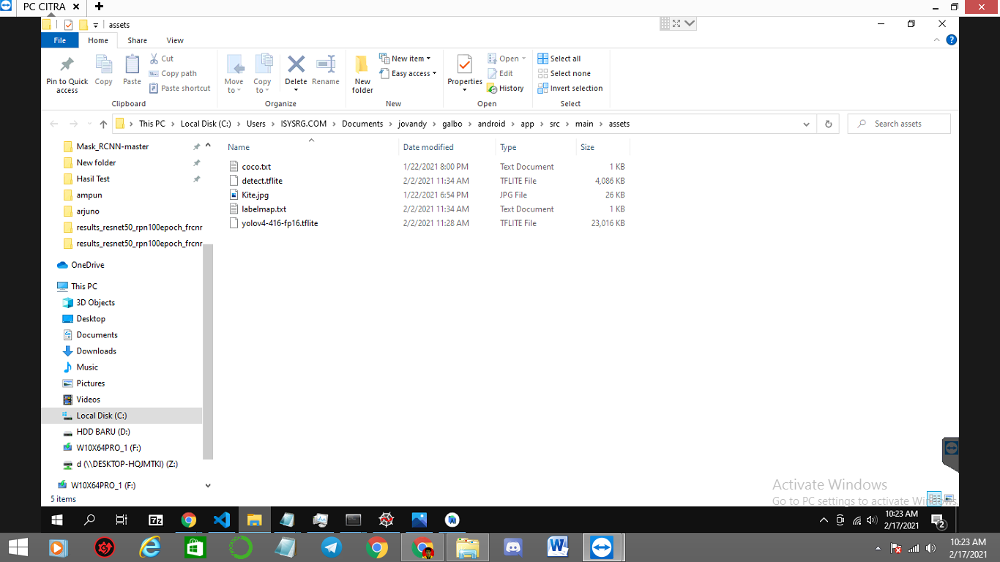
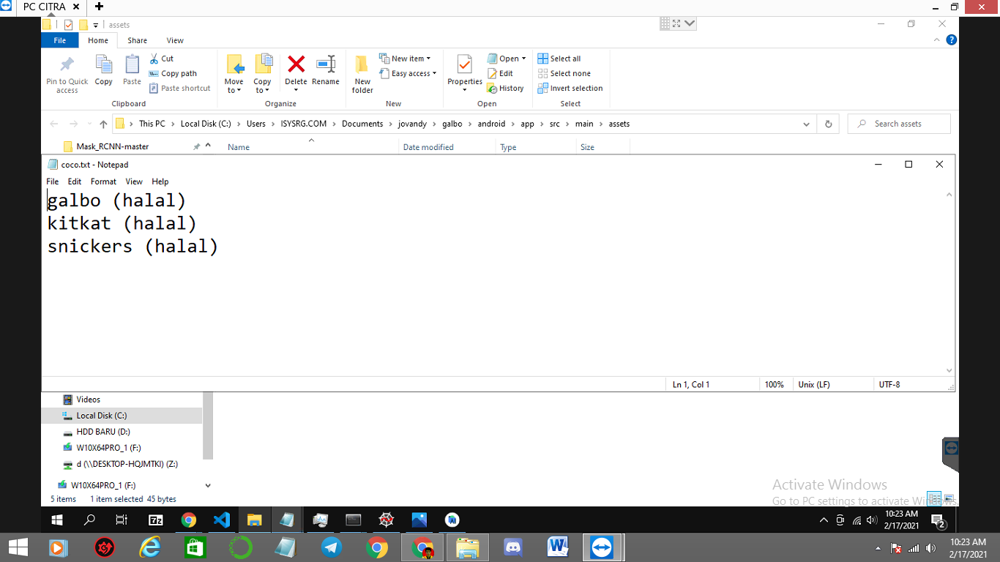
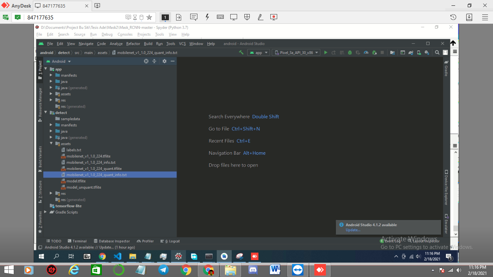
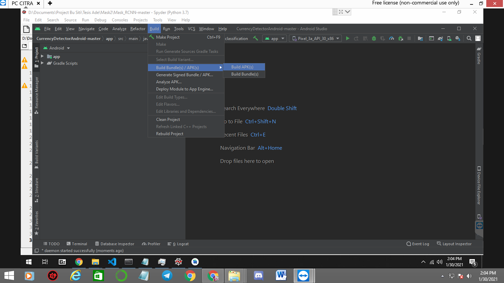
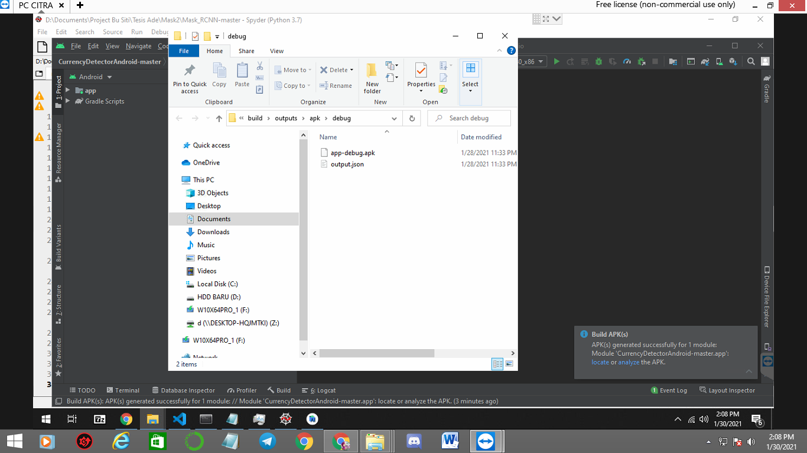

# Object-detection-classification-using-Mobile-Phone

This is an implementation of object detecton + classification using Yolov4 Tiny and teachable machine on Python 3, then implement it to mobile phone.

Download This: https://drive.google.com/file/d/18MGnFbQW8LV-eeSb_mCtkKqLUPaTUoZk/view?usp=sharing

The repository includes:
* Deploy it to Mobile phone 

# Getting Started
* Install Android Studio, u can download here https://developer.android.com/studio?hl=id
* Download this repo and download the android package (https://drive.google.com/file/d/18MGnFbQW8LV-eeSb_mCtkKqLUPaTUoZk/view?usp=sharing)
* deploy on mobile phone

# Change Object Detection Model yolov4

1. after u download this repo and android Package, go to that path using android Studio (exisiting project)

 

2.open path app/assets , there u can see the model yolov4-416-fp-16.tflite 

3. Then click that model, press right mouse and show explorer, this will direct u too model path and coco.txt (label path)

4. Just change the model and coco.txt as yours, in this case we use (yolov4 tiny model u can see my repo, how to train it, and about coco.txt make as your labels)

# Change Classification Model 

1. just change model classifcation go to show explorer and change with your model

# Deploy On Android

1. go to build - build APK

2. from here u get the app just put it to gdrive and download it (app-debug.apk)

# result 

